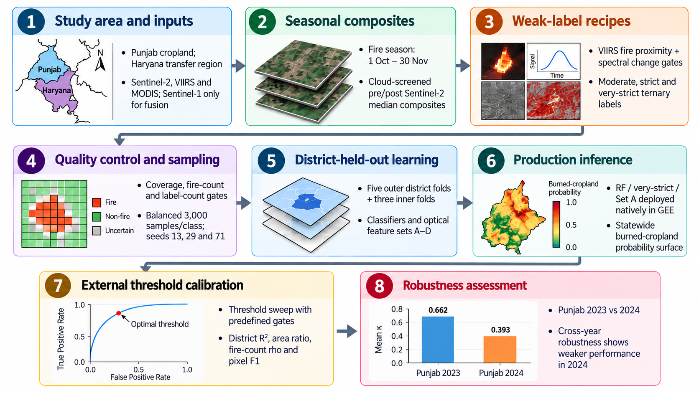

# Calibrated Weak Supervision for Post-Harvest Burned-Cropland Mapping Under Label Scarcity

**Mapping crop-residue burning with scarce labels through optical change, fire context, and external calibration.**

**Raunak Bhagate · Maitri Polisetty · R I Minu**

SRM Institute of Science & Technology

[Paper (PDF)](papers/burned_area_mapping_paper.pdf) · [Contact](mailto:rb7314@srmist.edu.in) · [Overview](#overview) · [Citation](#citation) · [Release plan](#release-plan)

---

> [!NOTE]
> Experiment code and reproduction scripts are being prepared for public release. See the [release plan](#release-plan).

## Overview

**Mapping small agricultural burns is challenging when reliable labels are scarce.** We study post-harvest burned-cropland mapping in Punjab, India, using Sentinel-2 spectral change and VIIRS active-fire context to construct weak labels.

**The framework connects weak supervision, spatial evaluation, and external calibration.** We compare pseudo-label recipes, feature representations, and classifier families using district-held-out evaluation, then calibrate a Google Earth Engine Random Forest map against MODIS MCD64A1 and district fire-count concordance.

The study supports **district-scale burden assessment and hotspot screening**. Internal scores measure agreement with weak labels; exact scar boundaries and stable year-to-year performance remain unestablished.

**[Read the paper for the full method, results, and limitations →](papers/burned_area_mapping_paper.pdf)**

## Highlights

- **Weak supervision under label scarcity.** Three label recipes combine fire proximity and optical change, with direct NBR and dNBR predictors excluded from model inputs.
- **Spatial evaluation and map calibration.** District-held-out model comparisons and external deployment-threshold selection are treated as distinct stages.
- **Transfer and robustness.** Experiments examine neighboring-state transfer to Haryana, cross-year performance in Punjab, and Sentinel-1/Sentinel-2 feature fusion.

## Release plan

| Item | Status |
|---|---|
| Paper (PDF) | ✅ [Available](papers/burned_area_mapping_paper.pdf) |
| Experiment code | ⏳ Being prepared |
| Reproduction scripts | 🚧 In progress |
| Setup and data-access instructions | ⏳ Planned with the code release |

## Citation

If you use this work, please cite the [paper](papers/burned_area_mapping_paper.pdf). Citation metadata is provided in [CITATION.cff](CITATION.cff).

## Contact

[Raunak Bhagate](mailto:rb7314@srmist.edu.in) · SRM Institute of Science & Technology
